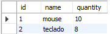
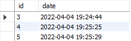
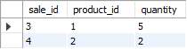

# Store Manager

# Sumário

 - [Contexto](#contexto)
- [Tecnologias usadas](#tecnologias-usadas)
- [Configuração inicial](#configuração-inicial)
- [Executando a aplicação](#executando-aplicação)
- [Testes](#testes)
- [Rotas](#testes)
	- [POST `/products`](#post-products)
	- [GET `/products`](#get-products)
	- [GET `/products/:id`](#get-products-id)
	- [PUT  `/products/:id`](#put-products-id)
	- [DELETE `/products/:id`](#delete-products)
	- [POST `/sales`](#post-sales)
	- [GET `/sales`](#get-sales)
	- [GET `/sales/:id`](#get-sales-id)
	- [PUT  `/sales/:id`](#put-sales)
	- [DELETE `/sales/:id`](#delete-sales)

# Contexto

Neste projeto foi desenvolvida uma API RESTful utilizando a arquitetura MSC e o banco de dados MySql.

A API trata-se de um sistema de gerenciamento de vendas, onde é possível criar, visualizar, deletar e atualizar produtos e vendas.
  

## Tecnologias usadas

> Desenvolvido usando: Javascript, Express, Node.js, Mysql, Mocha, Chai


## Configuração inicial

Instale as dependências do projeto: 

```bash
npm install
```

Para que o projeto funcione corretamente será necessário criar um arquivo do tipo `.env` com as variáveis de ambiente referentes ao banco de dados e portas a serem utilizadas. Por exemplo, caso o seu usuário SQL seja `nome` e a senha `1234` seu arquivo `.env` ficará desta forma:

```sh
MYSQL_HOST=localhost
MYSQL_USER=nome
MYSQL_PASSWORD=1234
PORT=3000
```

  Logo em seguida será necessário criar o banco de dados e as tabelas que vão compor o banco. Na raiz do projeto existe o arquivo `StoreManager.sql`, nele estão todas as queries necessárias para criar o banco e as tabelas. Basta executar o arquivo em alguma interface de `MySql`, como por exemplo a [MySQL Workbench](https://www.mysql.com/products/workbench/), ou copiar, colar e executar as queries dentro da interface SQL:

```sql
DROP DATABASE IF EXISTS StoreManager;

CREATE DATABASE StoreManager;

USE StoreManager;

CREATE TABLE products (
	id INT NOT NULL auto_increment,
	name VARCHAR(30) NOT NULL,
	quantity INT NOT NULL,
	PRIMARY KEY(id)
) ENGINE=INNODB;

CREATE TABLE sales (
	id INT NOT NULL auto_increment,
	date DATETIME DEFAULT CURRENT_TIMESTAMP,
	PRIMARY  KEY(id)
) ENGINE=INNODB;

CREATE TABLE sales_products (
	sale_id INT NOT NULL,
	product_id INT NOT NULL,
	quantity INT NOT NULL,
	FOREIGN KEY (sale_id)
		REFERENCES sales (id)
		ON DELETE CASCADE,
	FOREIGN KEY (product_id)
		REFERENCES products (id)
		ON DELETE CASCADE
) ENGINE=INNODB;

SET SQL_SAFE_UPDATES =  0;
```

O banco terá três tabelas: `products`, `sales` e `sales_products`.

A tabela `products` tem o seguinte formato:



A tabela `sales` tem o seguinte formato:



A tabela `sales_products`, é a tabela que faz o relacionamento `N:N` entre `products` e `sales` e tem o seguinte formato:


## Executando a aplicação

Para executar a aplicação normalmente:
```bash
npm start
```
Para executar em modo de desenvolvimento, com a ferramenta `Nodemon`, onde a cada vez que um arquivo é alterado, o servidor é reiniciado automaticamente, assim, não há a necessidade de utilizar o `npm start` a cada alteração feita nos arquivos.
```bash
npm run debug
```

## Testes

  A API possui até o momento somente testes unitários para a camada `Model`,  para rodar os testes basta executar o comando abaixo:
```bash
npm test
```

## Rotas

###  POST `/products`
Rota responsável por cadastrar novos produtos na tabela `products`. o `body` da requisição deve ter o seguinte formato:

```json
{
  "name": "produto",
  "quantity": 10
}
```
Exemplo de retorno com sucesso:
```json
{
  "id": 1
  "name": "produto",
  "quantity": 10
}
```

#### Regras:
- Atributos `name` e `quantity` não podem estar vazios;
- Atributo `name` não pode ter menos de 5 caracteres;
- Não será possível cadastrar um produto com o mesmo nome de um já cadastrado no banco;
- Atributo `quantity` deve ser igual ou maior que `1`.
---

###  GET `/products`
Rota responsável por listar todos os produtos cadastrados na tabela `products`.

Exemplo de retorno com sucesso:
```json
 [
    {
      "id": 1,
      "name": "produto A",
      "quantity": 10
    },
    {
      "id": 2,
      "name": "produto B",
      "quantity": 20
    }
  ]
```
---

###  GET `/products/:id`
Rota responsável por listar o produto especificado pelo `id` passado na rota.

Exemplo de retorno com sucesso:
```json
  {
    "id": 1,
    "name": "produto A",
    "quantity": 10
  }
```
Quando o `id` do produto não é encontrado:
```json
  { "message": "Product not found" }
```
---

###  PUT  `/products/:id`
Rota responsável por atualizar os dados de um produto específico na tabela `products`. O `id` do produto deve ser passado na rota, e o `body` da requisição deve ter o seguinte formato:

```json
{
  "name": "new_product_name",
  "quantity": 20
}
```
Exemplo de retorno com sucesso:
```json
{
  "id": 1
  "name": "new_product_name",
  "quantity": 20
}
```
Quando o `id` do produto não é encontrado:
```json
  { "message": "Product not found" }
```

#### Regras:
- Atributos `name` e `quantity` não podem estar vazios;
- Atributo `name` não pode ter menos de 5 caracteres;
- Atributo `quantity` deve ser igual ou maior que `1`.
---

###  DELETE `/products/:id`
Rota responsável por remover um produto da tabela `products` com base no `id` passado na requisição.

Exemplo de retorno com sucesso:
```json
   {
    "id": 1,
    "name": "produto A",
    "quantity": 10
  }
```
Quando o `id` do produto a ser deletado não é encontrado:
```json
  { "message": "Product not found" }
```
---

###  POST `/sales`
Rota responsável por cadastrar novos produtos na tabela `sales`. o `body` da requisição deve ter o seguinte formato:

```json
[
  {
    "product_id": 1,
    "quantity": 5,
  }
]
```
Exemplo de retorno com sucesso:
```json
  {
    "id": 1,
    "itemsSold": [
      {
        "product_id": 1,
        "quantity": 5
      }
    ]
  }
```

Também é possível cadastrar múltiplas vendas com uma requisição, exemplo com a venda de dois produtos:
```json
   [
    {
      "product_id": 1,
      "quantity": 2
    },
    {
      "product_id": 2,
      "quantity": 5
    }
  ]
```
Retorno do banco após o cadastro da venda de dois produtos:
```json
  {
    "id": 1,
    "itemsSold": [
      {
        "product_id": 1,
        "quantity": 2
      },
      {
        "product_id": 2,
        "quantity": 5
      }
    ]
  }
```

#### Regras:
- Atributos `product_id` e `quantity` não podem estar vazios;
- Atributo `quantity` deve ser igual ou maior que `1`.
---

###  GET `/sales`
Rota responsável por listar todas as vendas cadastradas na tabela `sales`.

Exemplo de retorno com sucesso:
```json
 [
    {
      "saleId": 1,
      "date": "2021-09-09T04:54:29.000Z",
      "product_id": 1,
      "quantity": 2
    },
    {
      "saleId": 2,
      "date": "2021-09-09T04:54:54.000Z",
      "product_id": 2,
      "quantity": 2
    }
  ]
```
---

###  GET   `/sales/:id`
Rota responsável por listar uma venda especificada pelo `id` passado na rota.

Exemplo de retorno de uma venda com múltiplos produtos:
```json
   [
    { 
      "date": "2021-09-09T04:54:29.000Z",
      "product_id": 1,
      "quantity": 2
    },
    {
      "date": "2021-09-09T04:54:54.000Z",
      "product_id": 2,
      "quantity": 2
    }
  ]
```
Quando o `id` da venda não é encontrado:
```json
  { "message": "Sale not found" }
```
---

###  PUT  `/sales/:id`
Rota responsável por atualizar os dados de uma venda específica na tabela `sales`. O `id` da venda deve ser passada na rota, e o `body` da requisição deve ter o seguinte formato:

```json
[
  {
    "product_id": 3,
    "quantity": 30
  }
]
```
Exemplo de retorno com sucesso:
```json
  {
    "saleId": 1,
    "itemUpdated": [
      {
        "product_id": 3,
        "quantity": 30
      }
    ]
  }
```
Quando o `id` da venda não é encontrado:
```json
  { "message": "Sale not found" }
```

#### Regras:
- Atributos `product_id` e `quantity` não podem estar vazios;
- Atributo `quantity` deve ser igual ou maior que `1`.
---

###  DELETE `/sales/:id`
Rota responsável por remover uma venda da tabela `sales` com base no `id` passado na requisição.

Exemplo de retorno com sucesso:
```json
  [
    { 
      "date": "2021-09-09T04:54:29.000Z",
      "product_id": 1,
      "quantity": 2
    },
    {
      "date": "2021-09-09T04:54:54.000Z",
      "product_id": 2,
      "quantity": 2
    }
  ]
```
Quando o `id` da venda a ser deletada não é encontrado:
```json
  { "message": "Sale not found" }
```